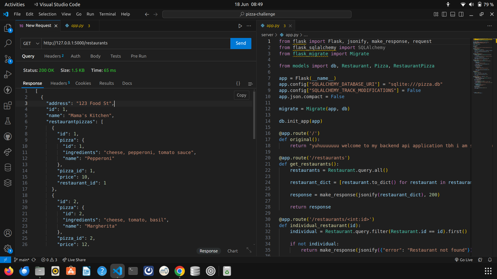
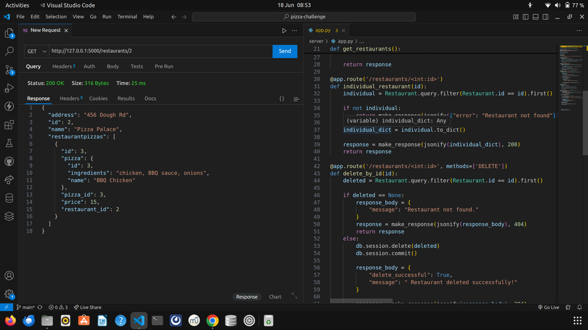
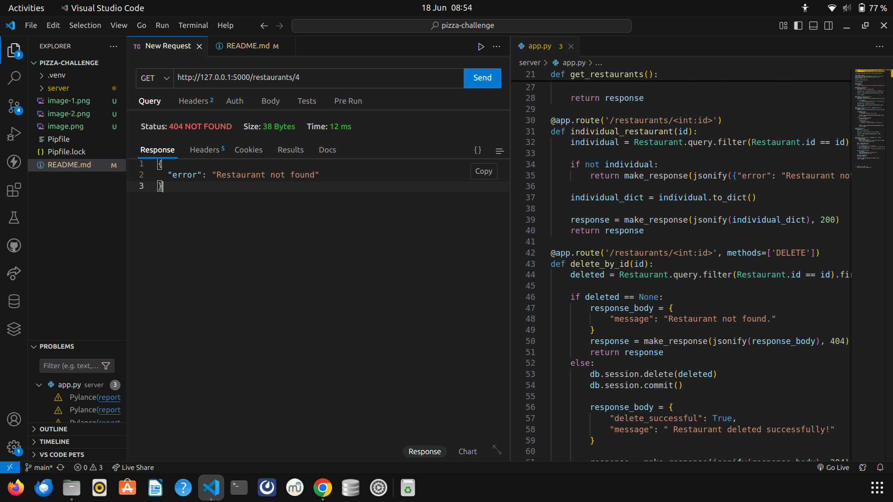
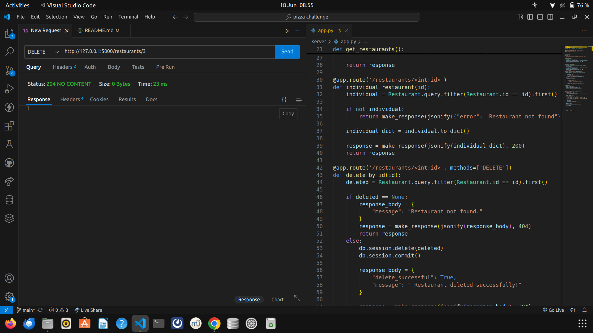
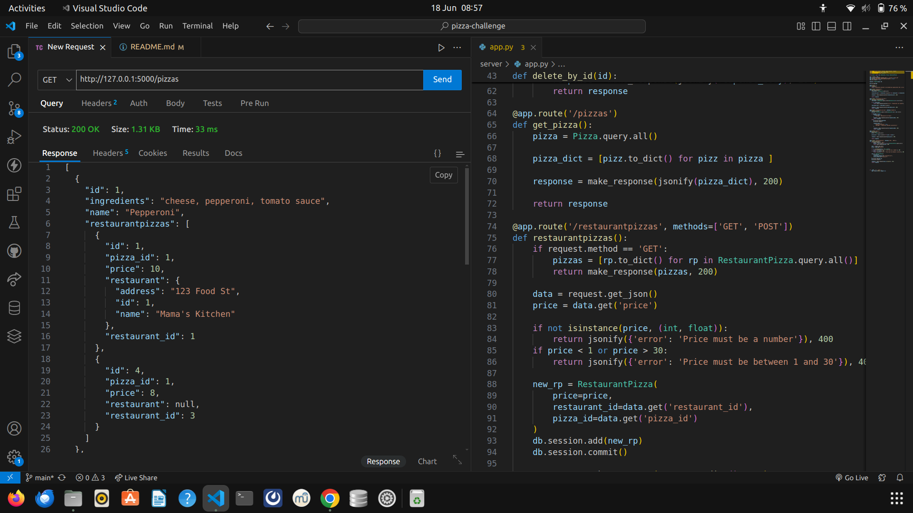
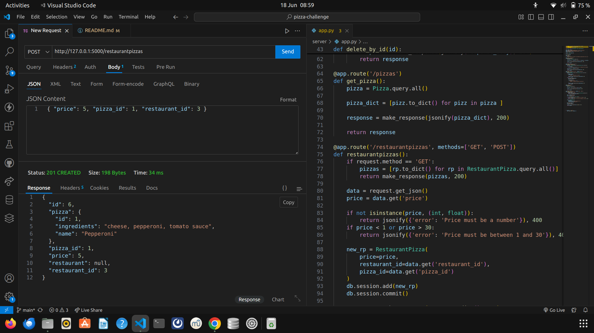
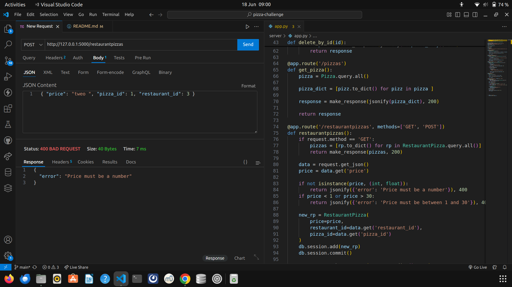
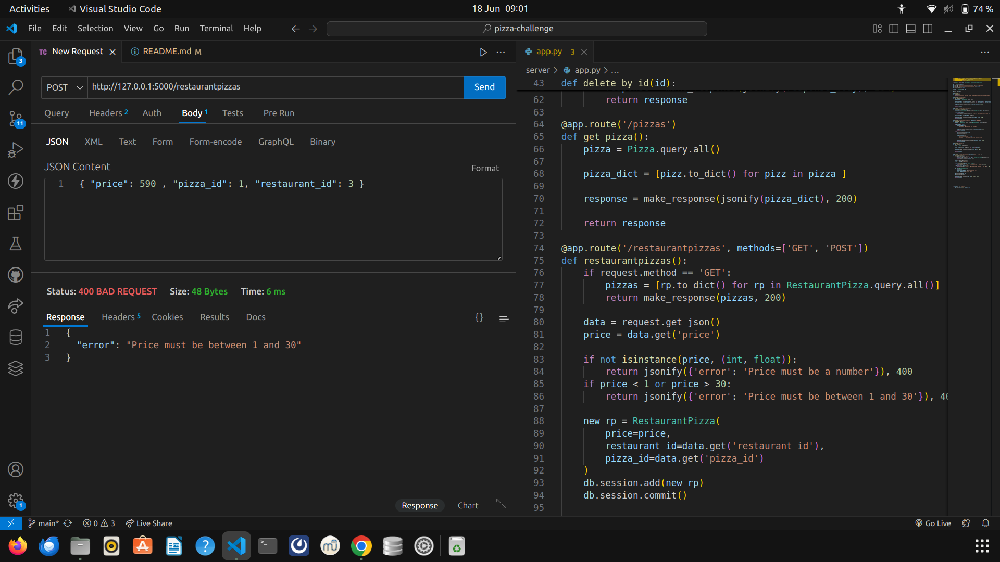

# Pizza Challenge

A simple Python CRUD application that manages customers, pizzas, and their orders using SQLAlchemy. This project helps reinforce key concepts of Object Relational Mapping (ORM) and database relationships.

## Project Purpose

The Pizza Challenge is designed to help you:

- Understand how to use SQLAlchemy as an ORM
- Practice creating and managing model relationships in Python
- Perform database operations like create, read, update, and delete (CRUD)
- Build and explore many-to-one and one-to-many relationships

## Installation and Setup

1. **Clone the repository**

   ```bash
   git clone https://github.com/Cristinakamuthu/pizza-challenge.git
   cd pizza-challenge
Create a virtual environment (recommended)

bash
python -m venv env
source env/bin/activate   
Install the dependencies

bash
pip install -r requirements.txt
Run the application

bash
python debug.py
What the Project Does
This project simulates a pizza ordering system where:

Features
- get (returns) a list of all restaurants



- get (returns) details of a single restaurant and its pizzas.


 - if not there brings out a message



- Deletes a restaurant and all related RestaurantPizzas




-  gets (returns) a list of pizzas



- Creates a new RestaurantPizza



 - if price is not an integer or beyond the range of 30 returns an error response :

 

 

Dependencies
Python 3.11+
SQLAlchemy
SQLite (comes with Python)
Install dependencies with:

bash
pip install -r requirements.txt
Examples
Run python debug.py to use an interactive shell where you can test the functionality.

Add a customer and a pizza
python
Copy
Edit
from models import Customer, Pizza, session

customer = Customer(name="Cristina Kamuthu")
pizza = Pizza(name="BBQ Chicken")

session.add_all([customer, pizza])
session.commit()
Place an order
python
Copy
Edit
from models import Order

order = Order(customer=customer, pizza=pizza)
session.add(order)
session.commit()
Get all pizzas ordered by a customer
python
print(customer.orders)       # Returns list of Order objects
print(customer.pizzas())     # Returns list of Pizza objects

Get all customers who ordered a specific pizza
python
print(pizza.orders)          # Returns list of Order objects
print(pizza.customers())     # Returns list of Customer objects
Notes


future plans
- adding a frontend using react 


